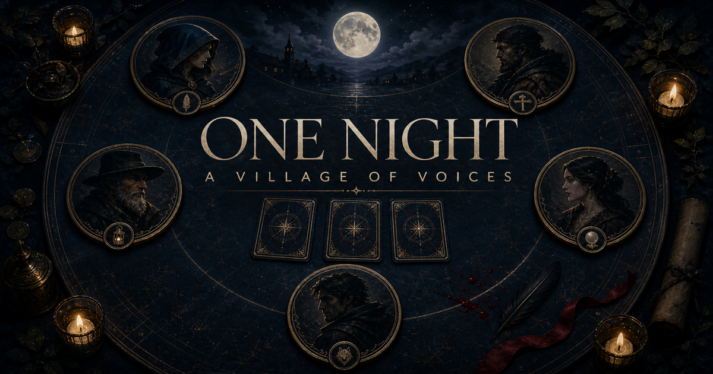
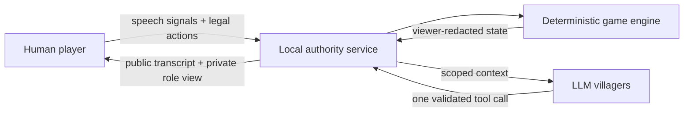

# One Night LLM

[](https://github.com/erickoch3/one-night-llm/actions/workflows/ci.yml)
[](LICENSE)
[](package.json)



One Night LLM is an experiment in multi-agent conversation disguised as a
one-night social-deduction game. One human joins two to six LLM villagers who
hold private roles, perform secret actions, compete for a shared speaking floor,
bluff, accuse, and collectively decide when the conversation is ready for a
vote.

The project explores a concrete question: **can autonomous model participants
share a live conversation without turn-taking while preserving strict
information boundaries?** A deterministic game engine owns truth and validates
every action; agents can influence the game only through one phase-scoped tool
at a time.

Codex is the primary agent runtime. It uses ChatGPT account sign-in through an
installed Codex app-server, so the game does not require an API key. A seeded,
fully offline rehearsal mode makes the complete game playable without an
account or model calls.

## What makes it interesting

- **No round robin.** Every participant privately signals who should speak, and
  a scored floor arbiter grants exactly one voice the floor.
- **Private knowledge stays private.** The server gives each agent only its own
  role, lawful night observations, and the shared public transcript.
- **Agents end the discussion.** Periodic private readiness ballots call the
  vote only after two-thirds of the agents agree; a human can also call it.
- **Models propose; code disposes.** Exact-schema tools validate every night
  action, statement, readiness choice, and vote before the pure engine accepts
  it.



## Quick start

### Requirements

- macOS
- Node.js 22.13 or newer
- npm
- Optional for Codex agents: an installed ChatGPT app, Codex app, or `codex`
  CLI

```bash
git clone https://github.com/erickoch3/one-night-llm.git
cd one-night-llm
npm ci
npm run dev
```

Then open:

- Game UI: [http://localhost:3000](http://localhost:3000)
- Local game service: [http://localhost:4318](http://localhost:4318)
- Health check: [http://localhost:4318/api/health](http://localhost:4318/api/health)

`npm run dev` starts both the web process and the local game service. Leave that
terminal running while playing.

If the default ports are occupied, both processes select an available local
port and stay paired automatically. Stopping the dev command also stops their
child processes.

### First game

1. Enter a display name and choose two to six agent players.
2. Choose **Codex agents** and click **Sign in with ChatGPT**, or choose
   **Rehearsal agents** to play without signing in.
3. Select the Classic or Wild Night role pack and deal.
4. Reveal your role, advance the narrated night one role at a time, complete any
   private action when your eyes open, then discuss and vote.

The first Codex game may ask you to sign in even when ChatGPT is already signed
in elsewhere. One Night deliberately uses its own private credential directory
rather than borrowing another app's token store. Browser login and device-code
login are both supported. To skip sign-in completely, choose rehearsal agents.

## How a game works

Every game has one card per player plus exactly three face-down center cards.
The role a player receives at the deal determines their night action. Swaps can
change the card in front of them; the final card determines their team at the
end.

The phases are:

1. **Deal and role reveal.** Each participant learns only their own starting
   role.
2. **Night.** Every configured wake role is called in a fixed order, including
   roles whose card is in the center. Everyone hears the same open/action/close
   ceremony, while observations, targets, and card movement appear only in the
   history of a participant who was entitled to know them.
3. **Discussion.** There is no round-robin order. Everyone privately signals
   conversational interest and the game grants one speaking floor at a time.
4. **Voting and reveal.** Each participant casts one vote. The engine resolves
   ties, Hunter chains, Tanner wins, and team wins, then reveals final roles.

Supported roles are Werewolf, Villager, Seer, Robber, Troublemaker, Drunk,
Insomniac, Minion, Hunter, and Tanner. The Classic pack prioritizes the core
deduction and swap roles; Wild Night brings special win conditions and more
role interactions into smaller games.

### Conversation without turns

Before each statement, every agent calls a private speech-interest tool with:

- one `0..10` score for how strongly it wants to speak; and
- one `0..10` score for how strongly it wants to hear from each other player.

The human uses the same protocol through UI signals. Typing sets the human's
desire to speak to `10` and all audience scores to `0`. Hovering another
player's portrait sets a strong request to hear from that player. These signals
influence the floor but do not guarantee it.

The default score is:

```text
0.65 * self desire
+ 0.35 * average audience desire
+ bounded waiting bonus
- immediate-repeat penalty
```

Only a participant with a current self or audience signal is eligible. Exact
ties use a rotating seat order. A global active-speaker lock and a per-room
operation queue ensure that two participants can never speak simultaneously.
Discussion has no fixed statement limit. After the table has had time to
develop its claims, every agent periodically makes a private boolean tool call
about whether another round would still help. Two-thirds agreement calls the
vote; one agreeing agent then announces that decision in chat before voting
begins. Individual readiness choices remain server-only. The human can also call
the vote after at least three statements.

## Agent modes

### Codex agents

Each night action, speech-interest choice, readiness check, spoken line, and
vote runs as an ephemeral Codex app-server turn with a phase-specific dynamic
tool. Tool inputs are validated before the deterministic game engine accepts
them. Agents receive the same ordered public night ceremony shown to the human,
the public transcript, their randomly assigned out-of-game voice profile, their
own starting role, and a role-scoped private night history containing only facts
that participant was allowed to witness or perform. Voice profiles are sampled
without replacement when a room is created and stay fixed for that match; they
affect phrasing and social style, never game knowledge.

Before dealing, the lobby can select GPT-5.6 Luna, Terra, or Sol and a reasoning
effort for every agent decision in that game. Luna with medium reasoning is the
default for its speed on short, structured turns.

The model-driver boundary disables web search, networked model tools, shell
commands, connectors, and arbitrary filesystem access. A turn completes as
soon as its one required game tool validates; the service does not wait for an
unused prose response afterward. Latency-sensitive discussion decisions have
short deadlines and skip whole-turn retries. If one times out or fails, a
deterministic understudy completes that move so the conversation keeps moving.

### Rehearsal agents

Rehearsal mode needs no account and makes no model calls. Seeded heuristics
select legal night actions, speech interest, dialogue lines, and votes. It is
useful for UI work, game-engine tests, and a quick demonstration.

## Two different kinds of identity

Codex authentication and player identity are intentionally separate:

- **Codex/ChatGPT sign-in** authorizes the installed Codex runtime to make model
  turns. Credentials live under One Night's private application directory and
  are shared by this local service, not used as a player ID.
- **Human player session** is a random opaque `one_night_player` cookie. It is
  `HttpOnly`, `SameSite=Lax`, and scoped to the local app. The entered display
  name is game presentation only; it is not an account.

The ChatGPT account email is used only for local connection status. It is not
placed in agent prompts, public transcripts, or game identity records.

## Configuration

The defaults need no configuration. See [`.env.example`](.env.example) for the
available variables:

| Variable                     | Default                                             | Purpose                                                                                                       |
| ---------------------------- | --------------------------------------------------- | ------------------------------------------------------------------------------------------------------------- |
| `ONE_NIGHT_API_PORT`         | `4318`                                              | Preferred starting port for the loopback game service; the dev launcher scans upward if occupied.             |
| `NEXT_PUBLIC_GAME_API_URL`   | selected loopback game-service URL                  | Set automatically by `npm run dev`; an exported value is useful only when running the web process separately. |
| `ONE_NIGHT_CODEX_EXECUTABLE` | auto-discovered                                     | Absolute path to a specific Codex executable.                                                                 |
| `ONE_NIGHT_CODEX_DATA_DIR`   | `~/Library/Application Support/One Night LLM/Codex` | Private Codex config and credential root.                                                                     |

Server variables must be exported before `npm run dev`. For example:

```bash
export ONE_NIGHT_CODEX_EXECUTABLE=/absolute/path/to/codex
npm run dev
```

The service binds to `127.0.0.1` and accepts browser requests from HTTP pages
served on `localhost` or `127.0.0.1`, regardless of which development port
Vinext selects. Non-loopback browser origins remain blocked.

## Verification

```bash
npm run typecheck
npm run lint
npm run test:unit
npm test
```

`npm test` runs type checking, deterministic game/service tests, a production
vinext build, and a rendered-HTML smoke test.

## Project structure

- `app/` — React game screens, interactions, animations, and accessibility UI
- `lib/game/` — deterministic rules, night reducers, speech arbitration,
  redacted views, voting, and resolution
- `lib/agents/` — provider-neutral prompts, dynamic tools, validation, and turn
  orchestration
- `lib/audio/` — procedural Web Audio cues and ambient sound
- `server/` — loopback HTTP service, server-owned rooms, Codex app-server
  transport, session boundary, and public snapshots
- `tests/` — engine, local service, and rendered-output coverage

See [Architecture and trust boundaries](docs/architecture.md) for the detailed
data flow, API surface, privacy model, and multiplayer extension path.

## Current limitations

- Rooms are in memory. Restarting the local game service clears active games.
- The shipped UI and room service create one human plus two to six agents. The
  domain model already distinguishes human and agent players and supports
  multiple human records, but networked lobbies, joins, reconnection, and
  per-viewer sessions are not implemented yet.
- This is a local loopback application, not a hardened public multiplayer
  server. It has no database, rate limiting, CSRF tokens, or remote deployment
  configuration for the stateful game service.
- Codex mode depends on the installed app-server protocol and a valid ChatGPT
  account entitlement. Rehearsal mode remains available when Codex is absent.

## Contributing

Bug reports, focused pull requests, and experiments with new roles or
conversation policies are welcome. Read [CONTRIBUTING.md](CONTRIBUTING.md) for
the development workflow and [SECURITY.md](SECURITY.md) for private
vulnerability reporting.

## Provenance and license

The TypeScript Codex runtime discovery, isolated credential-home pattern,
JSONL app-server transport, and dynamic tool boundary were adapted from the
author's related [Discourse](https://github.com/erickoch3/discourse) and
[Dendra](https://github.com/erickoch3/dendra) projects, then reduced, renamed,
and reimplemented for this TypeScript game. The same author and copyright
holder licenses this repository, including those adaptations, under the MIT
License.

Codex is discovered from an existing installation and is not bundled. Any
future redistribution of a Codex executable requires separate license and
product review.

The project source is available under the [MIT License](LICENSE).
