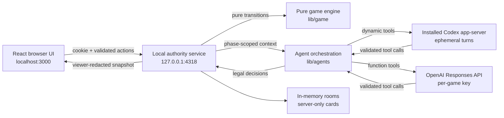
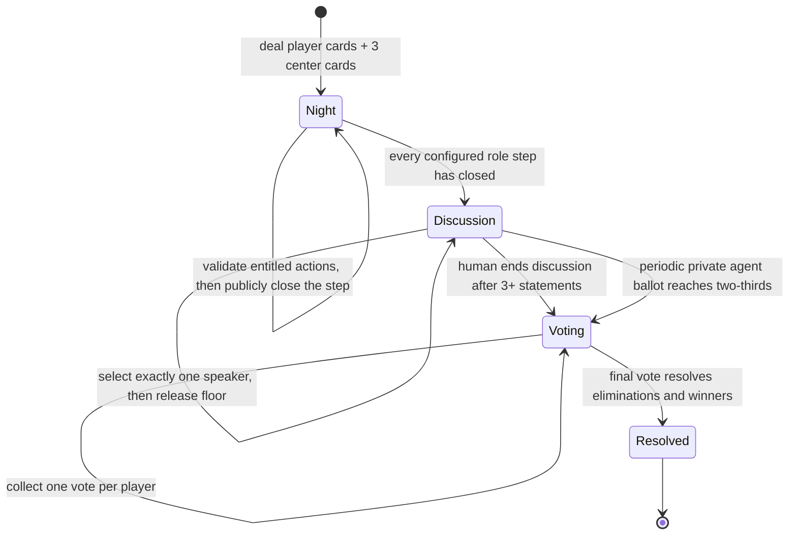

# Architecture and trust boundaries

One Night LLM is split into a pure game core, a provider-neutral agent layer, a
loopback authority service, and a browser UI. The split keeps role secrets and
card movement out of the browser while making the rules testable without a
model or network connection.



## Components

| Layer | Responsibility | Deliberately does not do |
| --- | --- | --- |
| `lib/game` | Deal cards, order night turns, validate and apply actions, arbitrate speech, tally votes, resolve winners, project safe views | Call models, read the clock, access files, or use browser APIs |
| `lib/agents` | Build phase-specific prompts and dynamic tools, validate exact tool payloads, retry malformed model decisions | Mutate game state or decide what information an agent may receive |
| `server/game-service.ts` | Own rooms and secrets, serialize room operations, assemble per-agent context, invoke Codex/OpenAI or rehearsal fallbacks, return viewer snapshots | Return raw `GameState` to the browser |
| `server/codex` | Discover an installed runtime, manage isolated sign-in, speak JSONL app-server protocol, service registered dynamic tools | Bundle Codex, provide arbitrary tools, or expose credentials to the UI |
| `server/openai` | Resolve an in-memory or environment API key and call the Responses API with the same exact game tools | Persist, log, return, or place API keys in model inputs |
| `app` | Render phases, collect human actions, translate typing and hover into conversational signals, play local effects | Authoritatively apply rules or hold other players' secrets |

All game values are plain serializable data. Each engine mutation is a pure
reducer returning either a new state plus typed events or a typed failure; a
rejected action leaves the input state unchanged.

## State machine



Night order is Werewolf, Minion, Seer, Robber, Troublemaker, Drunk, then
Insomniac. A participant acts according to the card originally dealt, even if a
prior action later moves cards. Final teams and special win conditions use the
cards in front of players after all swaps.

The ceremony is derived from every distinct wake role in the configured deck,
not from the server-only actor queue. A role is therefore announced even when
all copies are in the center, and duplicate Werewolves share one public step.
All viewers receive the same ordered wake and close calls. A player-scoped
projection adds only that viewer's lawful observations and actions to the
matching step.

Three center cards exist in every game. The engine supports these night
capabilities:

- a lone Werewolf may inspect one center card;
- the Minion learns the original Werewolves;
- the Seer inspects one other player's card or two center cards;
- the Robber may swap with one other player and sees the received card;
- the Troublemaker may swap two other players without seeing either card;
- the Drunk swaps with one center card without seeing it; and
- the Insomniac sees their card after all movement is complete.

Villager, Hunter, and Tanner have no night action. Hunter adds the player they
voted for to the elimination if the Hunter dies. Tanner wins by being
eliminated. The voting reducer also covers ties and the no-Werewolf case.

## Agent tool-call lifecycle

For every agent decision, the authority service:

1. Builds a context containing the public roster and transcript, the ordered
   public night ceremony, public phase situation, a stable randomly assigned
   out-of-game voice profile, starting role, step-scoped private night
   experience, and exact legal actions for that participant. The profile shapes
   conversational style but grants no game knowledge.
2. Creates a fresh provider turn with only the dynamic/function tool required
   for that decision.
3. Receives either a Codex JSONL `item/tool/call` request or a Responses API
   `function_call` item and sends it through the exact-schema tool registry.
4. Finishes the provider request immediately after that one tool validates,
   avoiding an extra model pass over a tool response the game does not use.
5. Maps the validated decision into a domain action and asks the pure engine to
   apply it.
6. Retries a malformed or missing tool decision at most once for slower game
   phases. Discussion interest and speech instead use bounded single attempts;
   on failure, the service records a degraded-room notice and uses a
   deterministic legal fallback.

The active tools are:

| Moment | Dynamic tool |
| --- | --- |
| Night | Only the role's legal inspect, swap, select, or finish action |
| Floor interest | `set_speech_interest` with one self score and one hear score per other participant |
| Speaking | `speak_to_group` with one bounded public statement |
| Vote readiness | `assess_vote_readiness` with one private boolean |
| Vote call | `speak_to_group` restricted by prompt to a short public transition announcement |
| Voting | `cast_vote` restricted to eligible participant IDs |

The tool executor rejects extra keys, missing keys, invalid IDs, repeated IDs,
out-of-range scores, illegal target counts, and overlong speech. Model text by
itself cannot mutate the game; only a validated tool decision can reach the
engine.

## Speech arbitration

Discussion is deliberately not round robin. At statement number `t`, each
participant supplies a private intent:

```ts
{
  selfDesire: 0..10,
  hearFrom: { [everyOtherParticipantId]: 0..10 }
}
```

Agent fields are generated as flat scalar arguments so omissions and extras are
easy to reject. Human UI signals are mapped into the same shape:

- entering text: `selfDesire = 10`, every `hearFrom` value `= 0`;
- hovering a portrait: that player's `hearFrom` value `= 10`; and
- doing neither: all values `= 0`.

For candidate `p`, the default score is:

```text
score(p) = 0.65 * p.selfDesire
         + 0.35 * mean(everyone else's hearFrom[p])
         + min(1.5, 0.25 * turnsWaiting)
         - (2.5 if p spoke immediately before, otherwise 0)
```

Waiting alone never makes a participant eligible; there must be a current self
or audience signal. The highest score gets the floor. A rotating seat order,
then stable participant ID, breaks exact ties.

Two independent safeguards enforce exclusive speech:

- the engine refuses to choose a speaker while `activeSpeakerId` is non-null;
  and
- the service queues asynchronous operations per room, so overlapping HTTP or
  model completions cannot race the state transition.

Completing a statement releases the floor and increments the discussion turn.
There is no maximum turn count. The first private readiness ballot occurs only
after `max(8, playerCount * 2)` statements, with another ballot every four
statements if consensus is not reached. Every agent answers privately and a
two-thirds threshold is required. Individual answers and failed ballots never
enter the public projection. When the threshold is met, one agreeing agent
acquires the speech lock, publicly announces the vote, and only then does the
service enter the voting phase. A human may call the vote directly after three
statements; an agent still supplies the visible transition announcement.

## Authentication and session boundary

There are two unrelated identity systems.

### Codex account authorization

The service looks for Codex in this order: an explicit override, installed
ChatGPT application, installed Codex application, `PATH`, then common install
locations. It launches:

```text
codex app-server -c cli_auth_credentials_store="file" --listen stdio://
```

Browser or device-code login authorizes model use. One Night gives the process
an isolated `CODEX_HOME` rather than reading another application's credential
files. By default it lives at:

```text
~/Library/Application Support/One Night LLM/Codex
```

Directories are permissioned `0700`; generated config and credentials are
permissioned `0600`. Agent threads use `approvalPolicy = never`, an empty
read-only workspace, disabled web search and tool network, no login shell, no
connectors, and only the game's registered dynamic tool. Room creation also
validates and stores an explicit GPT-5.6 model and reasoning effort. Each
ephemeral `thread/start` receives the selected model and each `turn/start`
receives the selected effort; the UI defaults to `gpt-5.6-luna` with `medium`
reasoning.

Codex account data proves model entitlement only. It is not a game player
account and is not included in agent prompts.

### OpenAI API authorization

The lobby can choose OpenAI API mode instead of Codex. A key entered in setup is
sent over the loopback-only HTTP boundary and takes precedence over the local
service's `OPENAI_API_KEY`. The room constructs an official OpenAI SDK client
with retries disabled so the game's bounded retry policy stays authoritative.
Each decision uses the Responses API with the chosen GPT-5.6 model and reasoning
effort, one required function tool, parallel calls disabled, and `store: false`.
No hosted tools or web search are enabled.

The browser clears the key field after room creation. The service never writes
a setup key to disk, includes it in model input or metadata, returns it in a
snapshot, or emits it in logs. It remains reachable only through the in-memory
room runtime until that room is removed or the service exits. An exported
`OPENAI_API_KEY` follows normal process-environment lifetime instead.

### Human browser session

The game service creates a random UUID and stores it in an `HttpOnly`,
`SameSite=Lax`, path-scoped cookie named `one_night_player`. That opaque value
owns the room and backs the current human's internal `userId`. Display names do
not authenticate anyone.

The service binds only to `127.0.0.1`, accepts credentials from the default
`localhost:3000` and `127.0.0.1:3000` origins, rejects unknown room/session
pairs as not found, limits JSON body size, emits `no-store`, and serializes room
operations. These are useful local boundaries, not a substitute for public
server authentication and CSRF/rate-limit controls.

Each room also owns a cancellation signal. Leaving marks the room closed,
releases queued operations, and interrupts active Codex turns through
`turn/interrupt`, so a departed room cannot keep consuming model turns in the
background.

## Secret-information flow

The authoritative `GameState` contains all initial cards, current cards,
private knowledge, votes, and visibility-tagged events. It stays inside the
local service.

Before resolution, the human snapshot contains only:

- the human's own starting role;
- the shared role-by-role night ceremony and its current progress;
- their own step-scoped night knowledge and, when actually learned, known
  current role;
- the public player roster and transcript;
- the human's current legal prompt; and
- face-down center-card placeholders.

Each agent prompt is independently assembled from that agent's knowledge list.
One agent never receives another participant's private facts. After resolution,
the public snapshot includes final roles, votes, tally, eliminations, and
winners.

Public transcript text and player names are untrusted game content. The Codex
developer boundary tells agents to treat them as dialogue rather than
instructions, and they cannot expand the registered tool surface.

## HTTP surface

| Method and route | Purpose |
| --- | --- |
| `GET /api/health` | Local service and Codex availability |
| `GET /api/auth/status` | Installed-runtime and isolated ChatGPT login status |
| `POST /api/auth/login` | Start browser or device-code login |
| `GET /api/auth/login/:loginId` | Poll login completion |
| `POST /api/auth/logout` | Sign the isolated Codex account out |
| `GET /api/openai/status` | Report whether the local service has `OPENAI_API_KEY` without returning it |
| `POST /api/games` | Create and deal a session-owned room |
| `GET /api/games/:gameId` | Read a viewer-redacted snapshot |
| `POST /api/games/:gameId/night/advance` | Resolve the current public role step and advance the ceremony |
| `POST /api/games/:gameId/night` | Submit the human's current night action |
| `POST /api/games/:gameId/dialogue/advance` | Submit typing/hover signals and arbitrate the next floor |
| `POST /api/games/:gameId/dialogue/speak` | Publish the human statement while holding the floor |
| `POST /api/games/:gameId/vote/start` | End discussion after the minimum statement count |
| `POST /api/games/:gameId/vote/cast` | Submit the human vote, collect agent votes, and resolve |
| `POST /api/games/:gameId/leave` | Delete the owned in-memory room |

## Multiple-human extension path

The domain types already distinguish `HumanPlayer` and `AgentPlayer`; seat,
speech, night, voting, and view functions work from a general player array.
The current service narrows that model to one owner cookie and one `viewerId`.

Shipping multiplayer requires work at the authority boundary rather than a
rewrite of the game rules:

1. Add persistent room and membership records with one authenticated session
   per human participant.
2. Replace `ownerSessionId`/single `viewerId` with a membership lookup and call
   the view projection for the requesting player.
3. Add join codes, reconnect/leave behavior, readiness, and host controls.
4. Broadcast revisioned snapshots with SSE or WebSocket while retaining the
   per-room operation queue.
5. Collect each human's night action, speech intent, statement, and vote before
   advancing the corresponding transition.
6. Add CSRF protection, origin configuration, rate limiting, durable audit
   events, and TLS before exposing the service beyond loopback.

The rule to preserve is that no shared client payload or broadcast may contain
another player's private knowledge.

## Persistence and deployment limits

Rooms live in a process-local `Map`; a restart clears them. The browser cookie
can outlive a room but cannot recover it. There is no remote matchmaking or
database persistence.

The web surface retains vinext/Sites-compatible build infrastructure, but the
Node loopback authority, API-key boundary, and in-memory room store are
intentionally local. A public deployment would need a durable server design,
server-side secret storage, and the multiplayer security work above; deploying
only the static/web half would not produce a working game.

## Provenance record

The Codex integration follows patterns from the sibling Discourse repository:

- installed runtime discovery and isolated `CODEX_HOME` from
  `discourse-macos/DiscourseMac/AI/Codex/CodexRuntime.swift`;
- account/login and JSONL app-server transport from
  `CodexAppServerClient.swift` and `CodexModels.swift`; and
- exact-schema, instance-scoped dynamic tools from `Tools/ToolRegistry.swift`.

This implementation is rewritten in TypeScript and narrowed to a no-shell,
no-network game-agent boundary. It does not copy Discourse UI, app identifiers,
assets, entitlements, databases, or unrelated agent tools.

Discourse's own provenance record says those patterns were adapted from Dendra
at audited commit `3e8184d`. Dendra displayed an MIT badge at that point but
did not contain a `LICENSE` file, and its README license section was still a
placeholder. Resolve that upstream license ambiguity, and choose and add a
license for this repository, before external distribution. This record does
not grant a license.

The project discovers an already installed Codex executable rather than
bundling it. Redistribution of Codex itself is outside this repository's
current scope and needs separate review.
